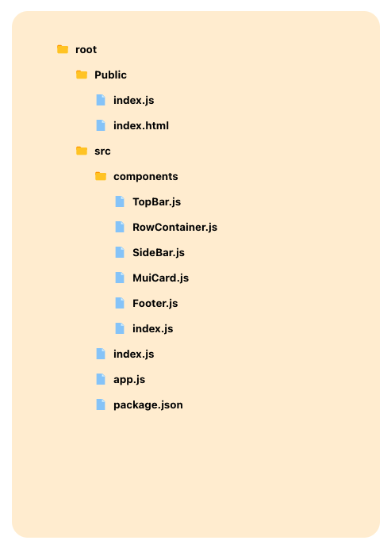

## Folder Structure in React Js

Listing files and folder in a presentable view in react js using recursive component invocation. For the sack of demonstration, json.js file is used as reference and [styled-components](https://styled-components.com/) is used for UI.

Here is [DEMO](https://react-folder-structure.netlify.app/)



## Install

Clone this repo, move to project folder and install dependencies;

```bash
# npm 
npm i
#yarn
yarn  
```

Then start project;

```bash
# npm 
npm run start
#yarn 
yarn start
```

